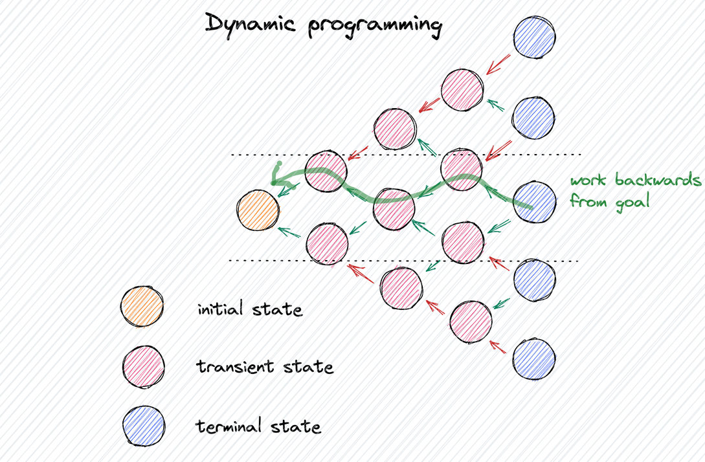
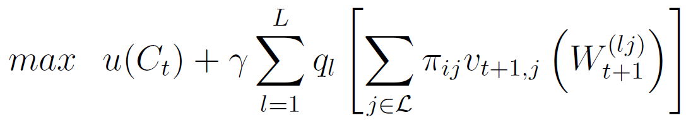
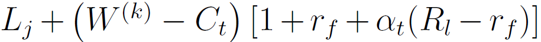

# MICROECONOMICS DYNAMIC STOCASTIC OPTIMIZATION

    

Welcome to the Microeconomics Dynamic Stocastic Optimization
_____________
This repo has been developed with the aim of applying the concepts of [Dynamic Programming](https://en.wikipedia.org/wiki/Dynamic_programming) to the microeconomics that could be used in everyone's life. In particular, the goal of this project is to solve an optimization problem whose outputs are the quantity of savings to allocate to investments every year and the percentage to allocate in risky assets (e.g. financial market stocks) and to risk-free assets. This optimization problem wants to maximize the wealth of the individual, giving him/herself the greatest possible quantity of savings to use in his/her life for everything he/she wants. The time horizon of the problem is 35 years, so what can be considered an average working career. The code has been developed in **Matlab**, while the optimization function is the following:

    

The function is composed of six terms:
<ul>
  <li>W(lj)t+1, the money available in the scenario <i>l</i> and in the working condition <i>j</i>;</li>
  <li>vt+1,j, the value function at the time <i>t+1</i> and in the working condition <i>j</i>;</li>
  <li>&pi;ij, the probability of passing from a working condition <i>i</i> to a working condition <i>j</i>;</li>
  <li>ql, the weight given to the rate estimated;</li>
  <li>&gamma;, the risk aversion;</li>
  <li>u(Ct), the utility function of the money used Ct, so it means how greatful is spending the money Ct in the period of time <i>t</i>.</li>
</ul>

The term W(lj)t+1 can be defined as:

    

## Contents
1. [What's needed](#whats-needed)

## What's needed
To use this code it is necessary having a Matlab subscription, in order to run it. No other tools are needed, the only thing that can be done is changing the parameters as wanted:
- *rf*, the annual rate of the risk free asset;
- *mu* and *sigma*, the average and standard deviation of the rate of the risky asset;
- *gamma*, the percentage of risk aversity of the individual (where 0 is a no risk averse person, while 1 is an extremely risk averse person);
- *numGridPoints*, the number of possibilities cosidered by the model;
- *numSimulations*, the number of times the simulation must be performed to average the results;
- *wageVector*, the 3 different wages for the conditions "employed", "part-time job", "unemployed";
- *numYears*, the number of years considered in the plan.

**Disclaimer** *The possible outputs that can be obtained with this programming code are NOT intended as investment advice, but are simply the result of analyses performed following dynamic programming method and given some author's assumptions, which are an absolutely personal choice. The quantity of savings allocated to investments must be weighted, reasoned and decided upon individually by the person performing it.*

    

